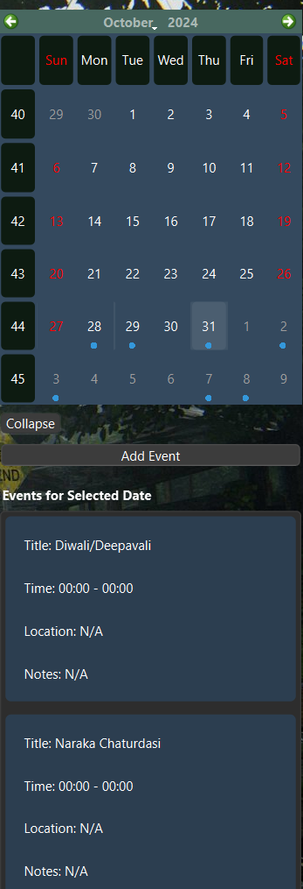

# 📅 Calendar App with Google Cloud Integration

This **Calendar App** integrates seamlessly with **Google Cloud** to manage events, reminders, and schedules. The app supports functionalities such as adding, editing, and viewing events, along with storing and syncing event data via **Google Cloud services**. Developed using **PyQt6** for the frontend, the app provides a smooth and interactive user experience.

## Features ✨

- 🗓️ **Create, View, and Manage Events**: Add and edit events with an intuitive UI.
- ☁️ **Google Cloud Sync**: Store events on Google Cloud for easy access across devices.
- 🔍 **Search & Filter**: Search events by date or name.
- 📆 **All-in-One View**: Get a clear overview of upcoming and past events.
- 🔔 **Reminders**: Set reminders for important events.
- 📈 **Recurring Events**: Create events that recur on a regular basis.

## Tech Stack 💻

- **Frontend**: PyQt6
- **Backend**: Python (Flask)
- **Google Cloud API**: Google Calendar API for syncing events

## Requirements 📋

Before getting started, ensure you have the following installed:

- Python 3.8+
- PyQt6
- Flask
- Google Cloud SDK (for API integration)
- Requests library

## Setup Instructions ⚙️

Follow these steps to set up the Calendar App on your local machine:

1. **Clone the repository**:
   ```bash
   git clone https://github.com/anshbhimani/Calendar-App-Google-Cloud.git
   cd Calendar-App-Google-Cloud
   ```

2. **Install dependencies**:
   Navigate to the project directory and install the required Python libraries:
   ```bash
   pip install -r requirements.txt
   ```

3. **Set up Google Cloud**:
   - Create a project on the [Google Cloud Console](https://console.cloud.google.com/).
   - Enable the **Google Calendar API** for your project.
   - Create OAuth 2.0 credentials (Client ID) and download the `credentials.json` file.
   - Place the `credentials.json` in the root directory of the project.

4. **Configure Environment Variables**:
   You may need to set up the following environment variables in your system:
   - `GOOGLE_CLOUD_PROJECT`: Your Google Cloud project ID.
   - `FLASK_APP`: The entry point for your Flask application.
   
   Example:
   ```bash
   export GOOGLE_CLOUD_PROJECT=your_project_id
   export FLASK_APP=app.py
   ```

5. **Run the Application**:
   Start the Flask backend:
   ```bash
   flask run
   ```

   Run the PyQt6 frontend:
   ```bash
   python main.py
   ```

6. **Access the App**:
   - The app will open in the PyQt6 window, providing an interface to manage your calendar events.
   - Events will be synced with your Google Cloud account automatically.

## How to Use 🛠️

1. **Add Events**: Click the "Add Event" button and fill in the event details.
2. **View Events**: Navigate through the calendar to see scheduled events.
3. **Edit/Delete Events**: Select an event to edit or delete it from the app and Google Calendar.
4. **Sync with Google Cloud**: Events are automatically synced to your Google Calendar when added or updated.

## Automation on Startup ⚙️

To ensure the app runs every time you start your PC:

- Use **Task Scheduler** (Windows):
   1. Open Task Scheduler.
   2. Create a new task, pointing to the `main.py` script for the PyQt6 frontend and `flask run` for the backend.
   3. Set triggers and options to run at startup and minimize to background.

## Contributions 🛠️

Feel free to fork this repository, raise issues, and submit pull requests. Contributions are welcome! 🎉

## License 📜

This project is licensed under the **MIT License**.


